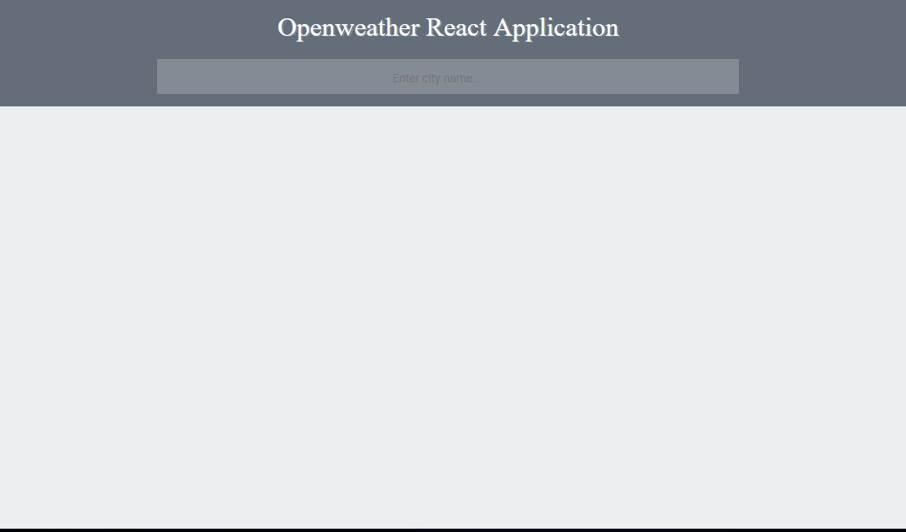
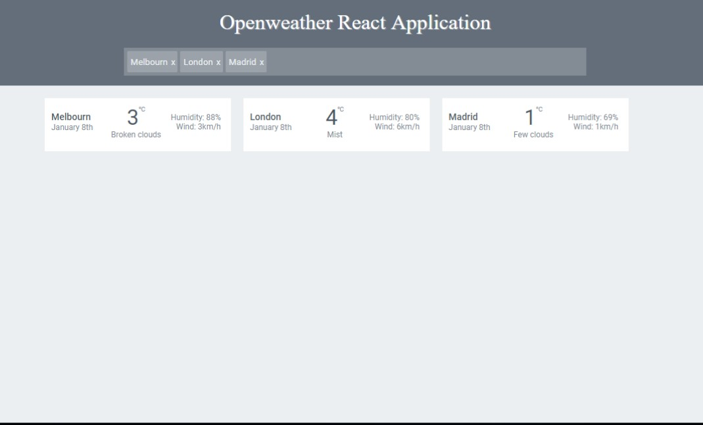

# React
Simple weather application

This is a simple application created with React.js

This application shows the current weather conditions for the city(cities) you are searching using the API at [Open Weather].
The app is consisted from one input field where you will enter the city name(s). 

  

By clicking Enter on your keyboard, browser will render a box with the weather details for the stated city(cities).
The entries you've made will turn into buttons with possibility to remove the city from the list, along with the weather details.

  

I am using HTML/SASS, React.js and ES6 for building components.

For making HTTP calls I am using ajax, by stating the correct URL path with the fetched parameter from the input filed.
This simple app is consisted from three components: 

WeatherApp: which is the main component
WeatherDetals: which receives the array for mapping through, in order to collect all necessary data
WeatherItem: which just returns the box with the weather details

